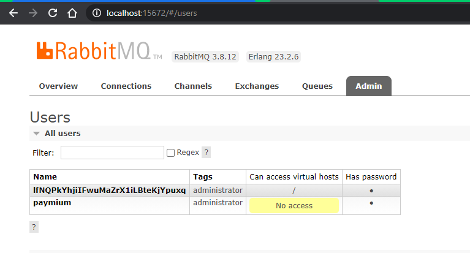
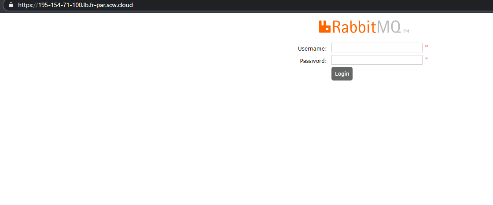

# paymium-k8s

## 1 Check the kubernetes cluster
### 1.1 Describe the command you use to connect to this cluster.

As the cluster will not be used later, I made a temporary alias to connect it :
````bash
$ alias kubpay="kubectl --kubeconfig=/home/bartoua/kubeconfig_paymium"
````

### 1.2 Give a detailed output of the cluster node(s) (kubernetes version, IP, OS Image, Container runtime)

`````bash
$ kubpay describe nodes
Name:               scw-devops-test-devops-test-pool-bbd5a6-941624
--- SNIP ---
System Info:
  Machine ID:                 01955f048d07a2ddf867d395602f746b
  System UUID:                8c777faf-750c-4382-b5c6-5cf145923a3d
  Boot ID:                    8794e604-ec6e-42b1-bcd2-2aa34ed9299c
  Kernel Version:             5.4.0-53-generic
  OS Image:                   Ubuntu 20.04.1 LTS 2da9bb3059
  Operating System:           linux
  Architecture:               amd64
  Container Runtime Version:  containerd://1.4.3
  Kubelet Version:            v1.20.4
  Kube-Proxy Version:         v1.20.4
--- SNIP ---
`````

## 2 Setup a load balancer to expose internal services
### 2.1 Deploy a modified Nginx controller for Scaleway Provider
```bash
$ wget https://raw.githubusercontent.com/kubernetes/ingress-nginx/controller-v0.44.0/deploy/static/provider/scw/deploy.yaml -o deploy_nginx.yaml

$ kubpay apply -f  deploy_nginx.yaml
namespace/ingress-nginx created
serviceaccount/ingress-nginx created
configmap/ingress-nginx-controller created
clusterrole.rbac.authorization.k8s.io/ingress-nginx created
clusterrolebinding.rbac.authorization.k8s.io/ingress-nginx created
role.rbac.authorization.k8s.io/ingress-nginx created
rolebinding.rbac.authorization.k8s.io/ingress-nginx created
service/ingress-nginx-controller-admission created
service/ingress-nginx-controller created
deployment.apps/ingress-nginx-controller created
validatingwebhookconfiguration.admissionregistration.k8s.io/ingress-nginx-admission created
serviceaccount/ingress-nginx-admission created
clusterrole.rbac.authorization.k8s.io/ingress-nginx-admission created
clusterrolebinding.rbac.authorization.k8s.io/ingress-nginx-admission created
role.rbac.authorization.k8s.io/ingress-nginx-admission created
rolebinding.rbac.authorization.k8s.io/ingress-nginx-admission created
job.batch/ingress-nginx-admission-create created
job.batch/ingress-nginx-admission-patch created
```
### 2.2 Deploy a modifed version of Nginx controller
Edit `deploy_nginx.yaml` to add the annotation `service.beta.kubernetes.io/scw-loadbalancer-use-hostname: 'true'` at line 268.

````bash
$ kubpay apply -f deploy_nginx.yaml
namespace/ingress-nginx unchanged
serviceaccount/ingress-nginx unchanged
configmap/ingress-nginx-controller unchanged
clusterrole.rbac.authorization.k8s.io/ingress-nginx unchanged
clusterrolebinding.rbac.authorization.k8s.io/ingress-nginx unchanged
role.rbac.authorization.k8s.io/ingress-nginx unchanged
rolebinding.rbac.authorization.k8s.io/ingress-nginx unchanged
service/ingress-nginx-controller-admission unchanged
service/ingress-nginx-controller configured
deployment.apps/ingress-nginx-controller configured
validatingwebhookconfiguration.admissionregistration.k8s.io/ingress-nginx-admission configured
serviceaccount/ingress-nginx-admission unchanged
clusterrole.rbac.authorization.k8s.io/ingress-nginx-admission unchanged
clusterrolebinding.rbac.authorization.k8s.io/ingress-nginx-admission unchanged
role.rbac.authorization.k8s.io/ingress-nginx-admission unchanged
rolebinding.rbac.authorization.k8s.io/ingress-nginx-admission unchanged
job.batch/ingress-nginx-admission-create unchanged
job.batch/ingress-nginx-admission-patch unchanged
````

I check if the LoadBalancer `EXTERNAL-IP` is a FQDN instead of an IP address.

````bash
$ kubpay get service -n ingress-nginx
NAME                                 TYPE           CLUSTER-IP     EXTERNAL-IP                          PORT(S)                      AGE
ingress-nginx-controller             LoadBalancer   10.44.97.179   195-154-71-100.lb.fr-par.scw.cloud   80:32579/TCP,443:31038/TCP   81m
ingress-nginx-controller-admission   ClusterIP      10.32.52.105   <none>                               443/TCP                      81m
````

### 2.3 Could you explain our choice to prefer a hostname instead of an IP for our load balancer ?
There are multiple reasons to use a FQDN instead of an IP.
For me the main reason is a maintainability problem, if you use IP as main address your configs are dependants of the address stability, FQDN permits a better reliability by masking the IP.
The second reason is an IP address is the main search method for crawlers looking for an open service.

## 3 RabbitMQ deployment
### 3.1 Deploy version 1.3.0 of the RabbitMQ cluster-operator
```bash
$ wget https://github.com/rabbitmq/cluster-operator/releases/download/v1.3.0/cluster-operator.yml
$ kubpay apply -f cluster-operator.yml
namespace/rabbitmq-system created
customresourcedefinition.apiextensions.k8s.io/rabbitmqclusters.rabbitmq.com created
serviceaccount/rabbitmq-cluster-operator created
role.rbac.authorization.k8s.io/rabbitmq-cluster-leader-election-role created
clusterrole.rbac.authorization.k8s.io/rabbitmq-cluster-operator-role created
rolebinding.rbac.authorization.k8s.io/rabbitmq-cluster-leader-election-rolebinding created
clusterrolebinding.rbac.authorization.k8s.io/rabbitmq-cluster-operator-rolebinding created
deployment.apps/rabbitmq-cluster-operator created
```

### 3.2 Deploy a RabbitMQ cluster
```bash
$ kubpay apply -f rabbitmq.yaml
rabbitmqcluster.rabbitmq.com/simple-rabbit created
````

To scale the node up to 3, I have to declare a ReplicaSet by adding to `rabbitmq.yaml`:
````yaml
spec:
  replicas: 3
````

### 3.3 Connect to RabbitMQ dashboard
#### 3.3.1 Give the command to connect locally on the remote dashboard
```bash
$ kubpay port-forward simple-rabbit-server-0 -n default 15672:15672
```

#### 3.3.2 Retrieve the credentials and connect as an admin on Rabbitmq dashboard
The default credentials are located here :
```bash
rabbitmq@simple-rabbit-server-0:/$ cat /etc/rabbitmq/conf.d/default_user.conf
default_user = lfNQPkYhjiIFwuMaZrX1iLBteKjYpuxq
default_pass = o5lyXGsYSFEjcnactVcEuv-kItJS9gAw
```

The password is : DpWIzfzHnDAdtCayjhujI3bEZNR/MTpX+x55Z+raR4uSCqwK5nVtdt7Fa+Fa09uy


### 3.4 Expose the rabbitmq cluster on Internet
```bash
$ kubpay apply -f rabbitmq-ingress.yaml
ingress.networking.k8s.io/rabbitmq-ingress created
````


### 3.5 Explain how to secure the connection
I never do it with lentsencrypt but I will follow the documentation regarding cert-bot and echo ingress.
First we need to make a DNS resolution to the Ingress endpoint IP with the FQDN simple-rabbit.paymium.com. 
Then we need a letsencrypt cert-manager to replace the nginx one.

